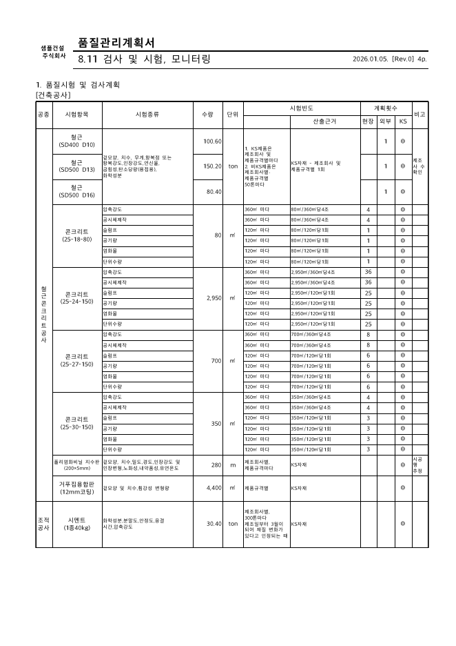
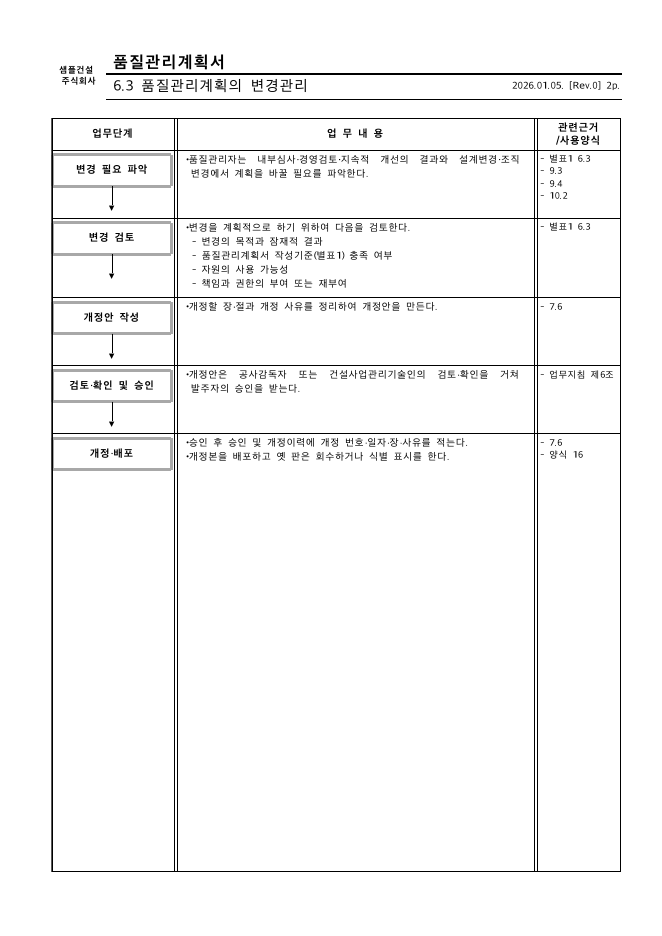

# 단번(Danburn) — 도급내역서로 품질관리계획서 만들기

> **In English** · [danburn.kr/en](https://danburn.kr/en)
>
> Danburn is an open-source **Claude Code plugin** (and CLI) that turns a contractor's bill of quantities (xlsx) into a draft Quality Management Plan (HWPX) for Korean apartment construction sites. The test plan inside it is calculated from Appendix 2 of the government's quality management guideline (건설공사 품질관리 업무지침 별표2).
>
> - **Install in Claude Code:** `claude plugin marketplace add https://github.com/yj5306yj/danburn`, then `claude plugin install danburn@danburn`.
> - **Three skills:** `/danburn:start` drafts a new plan, `/danburn:check` checks whether an existing plan (hwp, hwpx, pdf) cites current standards, `/danburn:test-plan` exports the test plan alone as HWPX and Excel.
> - **How the work is split:** Claude runs the tool and carries its questions and results through the conversation, deterministic code reads the spreadsheet, matches items to test rules and calculates the counts, and a quality manager confirms.
> - **No separate API key:** the plugin runs inside your own Claude Code session, so there is no key to set up.
> - **Also a plain CLI:** `uv tool install git+https://github.com/yj5306yj/danburn`, then `danburn start`.
>
> Built and maintained by Sanghyun Lee, a former site quality manager. Built with Claude Code. The output is a draft for review, not a guarantee of approval. The full documentation below is in Korean.

**공동주택 현장의 도급내역서와 현장 정보를 넣으면 품질관리계획서(한글 HWPX) 한 권이 나옵니다.** 1~10장의 틀(장·절·표·양식)은 전부 만들어 주고, 절마다의 문장은 현장에 맞게 고쳐 쓰는 **공통 초안**이며, **8.11 시험계획은 「건설공사 품질관리 업무지침」 별표2로 시험횟수를 계산**해 채웁니다.

```
도급내역서(xlsx) + 현장 정보 파일(yaml)  →  품질관리계획서 HWPX 한 권
                                          (표지·목차·개정이력·1~10장 33절, 8.11 시험계획 자동 계산)
```

**하려는 일을 고르면 됩니다.**

| 하려는 일 | 명령 |
|---|---|
| **새로 만들기** — 도급내역서(xlsx)로 초안부터 | `danburn start` |
| **기존 계획서 검사** — 이미 가진 계획서(hwp·hwpx·pdf)의 기준(업무지침·법령·KCS/KDS/LHCS)이 현행인지 | `danburn check 계획서.hwp` |
| **시험계획서만 따로** — 새로 만들기를 한 번 한 뒤, 그 산출 폴더에서 품질시험계획서만 한글·엑셀로 | `danburn test-plan --project 산출폴더/project.yaml` |

`danburn` 만 치면 셋 중 하나를 고르라고 묻습니다. **이미 계획서가 있다면** 새로 만들기 전에 `check` 로 옛 기준을 인용하는지부터 보세요 — 업무지침이 개정되면 기존 계획서는 다시 세워야 할 수 있습니다([기존 계획서 검사](#기존-계획서-검사--danburn-check)).

**설치**([uv](https://docs.astral.sh/uv/) 필요): `uv tool install git+https://github.com/yj5306yj/danburn` 한 번 → 그다음 `danburn start`(새로 만들기) · `danburn check 계획서.hwp`(기존 계획서 검사). 새 기준 받기는 `uv tool upgrade danburn`(`danburn` 명령을 못 찾으면 `uv tool update-shell` 뒤 창을 다시 엽니다). Claude Code 사용자는 [플러그인](#에이전트-스킬로-쓰기--claude-codecodex-같은-ai-코딩-에이전트를-쓰는-분께)으로 `/danburn:start`·`/danburn:check`·`/danburn:test-plan`. 저장소를 받아 개발용으로 쓰는 방법은 [처음 한 번 준비](#처음-한-번-준비-3단계)(맥)·[Windows에서 쓰기](#windows에서-쓰기)에 있습니다.

- **danburn** 은 터미널(명령 창)에서 실행하는 프로그램 이름입니다. 명령 몇 줄로 돌립니다.
- **현장 정보 파일(yaml)** 은 공사명·회사·사람을 적는 설정 파일입니다. 예시 파일을 복사해 메모장 같은 편집기로 값만 고칩니다([만드는 법](#현장-정보-파일-만들기)).
- **명령줄이 낯설면** Claude Code·Codex 같은 AI 에이전트에게 대화로 시킬 수 있습니다([에이전트 스킬로 쓰기](#에이전트-스킬로-쓰기--claude-codecodex-같은-ai-코딩-에이전트를-쓰는-분께)).

| 8.11 품질시험계획표(계산) | 절마다 들어가는 업무 흐름표 |
|---|---|
|  |  |

*그림은 합성 예제(`examples/`)로 만든 계획서입니다. 실제 현장·회사·사람과 무관합니다.*

결과는 **제출 전 검토용 초안**입니다. 법정 서식 충족이나 승인을 보장하지 않습니다. 현장 조건(발주처 특기시방·감리 지시)을 반영해 **품질관리자가 확인하고 확정**합니다. **만들 때는 한글(한컴오피스)이 필요 없고, 제출 전에는 한글로 열어 확인**합니다([한컴에서 확인하기](#한컴에서-확인하기)). API 키도 필요 없습니다.
맥에서 만들고 확인했습니다. **Windows**는 기존 Windows PC의 새 파이썬 환경에서 계획서 생성과 한글 열기를 확인했고, 그때 찾은 문제(인코딩·경로 등)를 고쳤습니다. 고친 판의 Windows 재확인은 아직입니다([Windows에서 쓰기](#windows에서-쓰기)).

## 무엇을 넣으면 무엇이 나오나

| 넣는 것 | 나오는 것 |
|---|---|
| 도급내역서(xlsx) — 지급·사급 내역 시트 | `품질관리계획서.hwpx` — 한글에서 열리는 계획서 한 권 |
| 현장 정보 파일(yaml) — 공사명·회사·사람·조직·장비 등 | `품질관리계획서.json` — 8.11 행마다 계산 근거 |
| (선택) 블록(동) 이름, 발주처(`--owner LH`), 로고 | 화면 요약 — 사람이 확인할 항목(아래 [결과 확인하기](#결과-확인하기)) |

> **내 내역서가 맞는 양식인지 먼저 1분 확인** — 시트 이름이 `지급(건)`·`지급(토)`·`내역(건)`·`내(건)` 같은 모양이고, 머리 행에 동(블록)별 `수량` 열이 있어야 합니다. 설치 뒤 `danburn inspect --boq 내역서.xlsx` 를 돌려 `"supported": true` 가 나오면 됩니다. 아니면 이 도구가 아직 읽지 못하는 양식입니다([읽는 내역서 양식](#읽는-내역서-양식)).

계획서에 들어가는 것:

- **1~10장 33절 전체의 틀**(별표1 작성기준 순서). 절마다 개요 칸(목적·적용범위·적용기준·관련문서·첨부 양식), **업무 분장표**(○작성 ◎검토 ●승인), **업무 흐름표**(업무단계·업무내용·관련근거). 문장은 공통 초안입니다.
- **기록 양식 42종**과 **부표**(리스크 평가 기준, 의사소통 관리 기준 등). 8.11의 품질검사 실시대장·성과 총괄표는 「건설기술 진흥법 시행규칙」 별지 제42호·제43호서식 모양을 따릅니다(제42호는 가로 쪽).
- **현장 자료 표**: 4.1 공사개요, 5.2 조직도와 조직 표, 6.2 품질목표, 8.11 시험장비·품질관리자 배치.
- **8.11 품질시험계획표**: 자재·규격별 시험종목·빈도·계획횟수·산출근거. 공종 칸을 채우고 공종별로 묶어 정렬하며, 설비 자재(배관 등)와 기계·전기 내역의 배관 터파기·되메우기(토목 토공으로 합산)도 계산합니다. 규칙이 없는 자재는 뒤쪽 ‘시험계획 미작성 자재’ 표에 따로 싣습니다.

## 처음 한 번 준비 (3단계)

**1. 이 저장소 받기** — 저장소 페이지의 **Code → Download ZIP**으로 받아 압축을 풉니다(git을 쓰면 `git clone <저장소 주소>`). 풀린 폴더를 `문서` 등 찾기 쉬운 곳에 둡니다.

**2. uv 설치** — [uv](https://docs.astral.sh/uv/)는 파이썬과 필요한 부품을 한 번에 설치해 주는 도구입니다. 맥에서 **터미널**(응용 프로그램 → 유틸리티)을 열고 한 줄 붙여 넣습니다. 끝나면 터미널을 닫았다 다시 엽니다.

```bash
curl -LsSf https://astral.sh/uv/install.sh | sh
```

**3. 받은 폴더에서 설치·실행** — 터미널에 `cd `(뒤에 빈칸)를 치고 받은 폴더를 터미널 창으로 끌어다 놓은 뒤 Enter. 그 폴더에서 설치(처음 한 번, 파이썬 3.12도 자동으로 받음)와 합성 예제 실행을 합니다.

```bash
uv venv --python 3.12 .venv && uv pip install --python .venv/bin/python -e .
.venv/bin/python scripts/make_example_boq.py
.venv/bin/danburn plan --boq examples/out/example_boq.xlsx --block 나동 --project src/danburn/data/templates/project.example.yaml --revision 0 --date "2026. 01. 05." --offline --out examples/out/품질관리계획서.hwpx
```

`examples/out/품질관리계획서.hwpx`가 생기면 준비 끝입니다. 합성 예제는 내역 50행 → 규격 묶음 40개 → 8.11 약 90행, 계획서 약 140쪽으로 나옵니다(규칙이 늘면 달라짐). 자세한 기대 결과는 [`examples/README.md`](examples/README.md)에 있습니다.

내 현장으로 돌리려면 [현장 정보 파일](#현장-정보-파일-만들기)을 만들고 아래처럼 바꿉니다. 끝의 `> out/요약.json` 은 화면 요약을 파일로도 남깁니다(요약은 따로 저장되지 않습니다).

```bash
.venv/bin/danburn inspect --boq 내역서.xlsx        # 읽을 수 있는지, 어떤 블록(동)이 있는지
mkdir -p out
.venv/bin/danburn plan --boq 내역서.xlsx --block "B동" --project 내현장.yaml --revision 0 --date "2026. 01. 05." --out out/품질관리계획서.hwpx > out/요약.json
```

명령의 칸 뜻:

- **`--block "B동"`** — 계획서를 만들 동(블록) 이름. `inspect`가 보여 준 이름의 일부를 적습니다. 동이 하나뿐인 내역서면 빼도 됩니다. 동이 여럿인데 빼면 **모든 동이 한 계획서에 동별 행으로 함께** 들어갑니다(예제: 나동만 89행, 빼면 178행). 없는 이름이나 여러 동에 걸리는 이름(예: `동`)을 주면 있는 동 목록을 보여 주고 멈춥니다.
- **`--revision 0 --date "2026. 01. 05."`** — 개정 번호와 그 개정 일자. 현장 정보 파일의 `개정이력`에 적은 일자와 **같은 날**이어야 합니다(다르면 멈추고 이유를 알려 줌). `2026-01-05`처럼 써도 같은 날로 봅니다. 표지·쪽 머리의 날짜는 `개정이력`의 글자대로 나옵니다.
- **`--offline`** — 예제용입니다. 내 현장으로 돌릴 때는 빼면, 계산 기준(업무지침 고시)이 현행인지 인터넷 공개 미러로 확인해 요약의 `basis_check`에 적습니다(키 필요 없음).
- **내 파일 두는 곳**: `내역서.xlsx`·`내현장.yaml`을 받은 폴더에 복사하거나, 명령에서 파일 이름 자리에 파일을 터미널 창으로 **끌어다 놓으면** 경로가 들어갑니다. LH 발주 현장이면 명령 끝에 `--owner LH`를 붙입니다.

## 결과 확인하기

계획서를 내기 전에 이 순서로 봅니다. 괄호 안 영어는 요약(JSON)에 나오는 이름입니다.

1. **요약 열기** — `plan`을 돌리면 화면에 요약이 나옵니다. 위 명령처럼 `> out/요약.json` 을 붙였으면 그 파일을 편집기로 엽니다(붙이지 않으면 화면에만 남습니다). 8.11 행별 계산 근거는 `out/품질관리계획서.json`에 있습니다.
2. **경고 먼저** — 경고(`warnings`)에 나온 자재부터 봅니다. 여기에 아래가 모입니다.
   - 발주처 기준 필요(`owner_standard_needed`): 별표2에 없는 자재(실링재·가구 등). 발주처 전문시방서 기준으로 시험계획을 직접 써야 합니다.
   - 규칙 없음(`uncovered_materials`): 별표2에는 있지만 이 도구에 규칙이 아직 없는 자재. 직접 작성합니다(규칙 추가는 [기여](#기여)).
   - 규칙 밖 행(`unmatched_in_covered`): 규칙이 있는 종류인데 그 규칙에 걸리지 않은 내역 줄(예: 시공·노무 줄). `produced: true`면 그 자재의 8.11 행은 이미 있습니다. **빠진 자재가 아닌지 내역 줄을 확인**합니다.
3. **옵션으로 다시 돌릴 것** — 아래가 해당하면 옵션을 더해 `plan`을 다시 돌립니다([명령행 상세](#명령행-상세)).
   - 레미콘 부위(`member_inferred`)에 `confirm: true` → 부위를 확인하고 `--formwork-sets`
   - 흔한 규격 누락(`missing_common_specs`, 예: 철근 D13) → 실제로 쓰면 `--add-spec`
   - 확인 필요 표시(`needs_confirmation`)의 "제조사 수 확인" → 철근 제조회사 수를 `--makers`, KS 인증품이 아니면 `--non-ks`
   - 토목을 여러 동 묶어 한 업체가 맡으면 `--civil-scope 공구`
4. **한글로 열어 채우기** — `품질관리계획서.hwpx`를 한글(맥은 무료 한글 Viewer)로 열어,
   - 8.11 뒤 ‘시험계획 미작성 자재’ 표의 자재마다 시험계획을 채웁니다.
   - 공종 빈 행(`work_missing` 개수만큼)의 공종 칸을 적습니다.
   - 확인 필요 표시가 붙은 행(비고 칸)을 현장에 맞게 고칩니다.
   - 토목으로 옮긴 토공(`earthwork_moved`)이 있으면 토공 물량이 맞는지 봅니다.
   - 현장측정 확인(`site_measurements_to_confirm`: 실내공기질·바닥충격음)을 계획에 넣을지 정합니다.
   - 절마다의 공통 문장·흐름표·양식을 현장 실정에 맞게 고칩니다.
   - 발주처가 `.hwp` 로 내라고 하면 한글에서 열어 '다른 이름으로 저장 → .hwp' 도 됩니다.
5. **한컴 체크리스트** — [한컴에서 확인하기](#한컴에서-확인하기)의 목록을 확인합니다.
6. **제출** — 기준 판(`basis_version`)이 현행인지(`basis_check`) 보고, 품질관리자가 확정해 냅니다.

합성 예제에서는 경고 2건(실링재·가구 — 발주처 기준 필요), 확인 필요 표시(철근 제조사 수 확인 등), 공종 빈 행 2, 토목으로 옮긴 토공 없음이 나옵니다.

## 계획서 구성 — 무엇이 계산이고 무엇이 문구인가

| 부분 | 어디서 오나 |
|---|---|
| 8.11 품질시험계획표, ‘시험계획 미작성 자재’ 표 | 도급내역서에서 **계산** |
| 표지·쪽 머리, 4.1 공사개요, 5.2 조직도·조직 표, 6.2 품질목표, 8.11 시험장비·품질관리자 배치, 개정이력·결재란, 양식 머리 칸(공사명 등) | 현장 정보 파일에서 **그대로** |
| 절마다 목적·적용기준·업무 분장표·업무 흐름표·양식·부표의 문장과 칸 | 별표1 작성기준 항목을 따라 이 저장소가 직접 쓴 **공통 문구**(`src/danburn/data/templates/qplan.yaml`). 모든 현장에 같은 문장이 들어가므로 현장 실정에 맞게 고쳐 씁니다 |

쪽 모양(여백·쪽 머리·표 열 비율·글자 크기)은 현장에서 쓰는 계획서 양식 관행에 맞추려고 실제 현장 계획서 한 부의 쪽 유형별 수치를 재어 맞췄습니다(수치만 쓰고 문장은 옮기지 않았습니다. [`docs/design/plan-layout.md`](docs/design/plan-layout.md)). 로고·회사명 칸은 비워 두며, 현장 정보 파일에 적으면 채워집니다.

## 현장 정보 파일 만들기

현장 정보 파일(yaml)은 공사명·회사·사람 같은 **계획서에 들어갈 글자**를 적는 텍스트 파일입니다.

1. `src/danburn/data/templates/project.example.yaml`을 복사해 `내현장.yaml` 같은 이름으로 저장합니다(합성 예시라 값이 모두 가짜입니다).
2. 텍스트 편집기(맥 텍스트 편집기, Windows 메모장, VS Code 등)로 열어 **따옴표 안의 값만** 고칩니다. `키: "값"` 모양과 줄 앞 칸 띄움은 그대로 둡니다. 저장은 UTF-8로.
3. `--project 내현장.yaml`로 넘깁니다.

| 항목 | 적을 것 | 들어가는 곳 |
|---|---|---|
| `공사명`·`공사위치`·`공사금액`·`공사기간` | 계약서의 공사 정보 | 표지, 4.1 공사개요, 본문 |
| `발주자`·`시공자`·`건설사업관리자` | 기관·회사 이름 | 4.1, 3장 용어, 7.5 의사소통 |
| `대지면적`·`건축면적`·`연면적`·`규모`·`구조`·`설계자` (선택) | 공사개요 칸 | 4.1 공사개요(비우면 그 줄을 뺌) |
| `현장대리인`·`품질관리자_등급` | 이름, 등급(초급·중급·고급·특급) | 5장, 7.1, 결재란 |
| `품질관리자` | 한 사람이면 이름 한 줄, 여럿이면 목록(직무·성명·등급·배치기간·비고) | 본문(첫 사람 이름), 8.11 품질관리자 배치 표 |
| `시험장비` (선택) | 목록(시험기구·규격·단위·수량·비고, 시험계획서 단독본은 제작사·기기번호·교정주기도) | 8.11 시험장비 표(비우면 빈 줄), 시험계획서 장비·교정 표 |
| `제조사수` (선택) | 자재마다 받는 제조사(골재원) 수. 예: `{철근: 8}`, 규격별은 `"철근:SD400 D13": 3` | 8.11 시험 횟수(없으면 1곳으로 계산) |
| `주요공종`·`계약특이사항` | 주요 공종, 계약상 특이사항(없으면 “없음”) | 4.1 공사개요 |
| `중점관리공종`·`품질방침` | 현장에서 정한 문장 | 8.7, 5.1 |
| `작성근거`·`적용제외`·`설계관리` | 계획서 작성 대상 근거, 적용하지 않는 절과 사유 | 1장, 2장, 8.3 |
| `문서번호`·`제정일자` | 문서 체계, Rev.0 일자 | 표지, 7.6, 개정이력 |
| `조직` | 한 줄에 한 사람(직무·성명·자격·담당). 선택 키 `상위`(윗사람 직무)를 적으면 **조직도**가 그려짐. `배치: 옆`(줄기 옆 상자), `구분: 본사`(본사/현장 점선), `등급`·`직급`(구성원 칸) | 5.2 조직도·조직 표 |
| `팀` (선택) | 업무 분장표 열(팀 이름). 없으면 템플릿 기본(현장대리인·품질·공사·공무·안전) | 모든 절의 업무 분장표 |
| `품질목표` | 한 줄에 한 목표 | 6.2 표 |
| `개정이력`·`결재` | 개정 번호·일자·장·사유, 작성·검토·승인자 | 개정이력 쪽, 결재란 |
| `회사명`·`로고`·`문서명` (선택) | 회사명, 내 컴퓨터의 로고 이미지 경로(PNG·JPEG), 쪽 머리 문서명 | 표지·쪽 머리. 비우면 칸만 남음(문서명은 “품질관리계획서”) |

`--revision`·`--date`는 `개정이력`과 맞아야 합니다. 새 개정이면 `개정이력`에 한 줄을 더하고 그 번호·일자를 줍니다(맞지 않으면 멈추고 이유를 알려 줌).

## 용어 풀이

- **8.11** — 품질관리계획서 8장 8.11 「검사 및 시험, 모니터링」. 자재별 시험종목·빈도·계획횟수 표가 들어가는 절이고, 이 도구가 계산하는 부분입니다.
- **별표1·별표2** — 「건설공사 품질관리 업무지침」(국토교통부고시)의 붙임표. 별표1은 품질관리계획서 작성기준(장·절 구성), 별표2는 자재·공종별 품질시험 종목과 빈도입니다.
- **업무 분장표·업무 흐름표** — 절마다 누가 작성·검토·승인하는지(○◎●) 적은 표와, 업무 단계별로 할 일·관련 근거를 적은 표.
- **로트·조** — 레미콘 압축강도 시험의 묶음 단위. 로트는 일정 물량(360㎥ 이내)마다 한 번 시험하는 묶음, 조는 한 번에 만드는 공시체 한 벌입니다. 로트당 조 수 = 기본 4조(28일 3 + 7일 1) + 거푸집 해체 판단용 조(부위에 따라 수직·수평·예비).
- **지급/사급** — 지급자재는 발주자가 직접 사서 주는 자재, 사급자재는 시공자가 사는 자재. 내역서의 `지급(건)`·`내역(건)` 같은 시트로 구분합니다.
- **블록·공구** — 블록은 내역서의 동·블록별 수량 열, 공구는 한 업체가 맡는 공사 구역. 토목은 여러 블록을 한 공구로 묶어 맡기도 합니다(`--civil-scope 공구`).
- **`--revision`** — 개정 번호. 최초 제정은 0, 이후 1·2·3…
- **종료 코드** — 명령이 끝나며 남기는 숫자. `0` 성공, `2` 입력 오류(파일을 만들지 않음). `check-basis`는 `0` 현행, `3` 개정됨, `4` 확인 못 함.
- 요약 항목 이름(영어)의 뜻과 할 일은 [결과 확인하기](#결과-확인하기)에 순서대로 있습니다.

## 얼마나 맞나(검증)

실제 공동주택 현장 한 곳의 도급내역서로 계획서를 만들어, 그 현장의 **승인된 계획서 8.11**과 행마다 대조했습니다(현장 자료는 공개하지 않습니다). 결과 요약:

- **레미콘 현장 물성시험**(슬럼프·공기량·염화물 등) 행은 수량과 시험횟수가 승인본과 일치.
- **레미콘 압축강도**는 로트 × 조 구성으로 승인본 횟수를 재현. 단, 부위별 거푸집 해체용 조는 부위 추정에 달려 있어 사람이 확인해야 합니다.
- **철근** 규격별 톤수가 승인본과 일치. 제조회사 수(시험 횟수에 영향)는 내역서에 없으므로 사람이 확인합니다.
- **별표2 규칙이 아직 없는 자재와 발주처 기준 자재**는 계획서의 ‘시험계획 미작성 자재’ 표와 요약 `warnings`로 알리게 했습니다. 이 자재들의 시험계획은 직접 써야 합니다. 품명이 특이한 줄은 자재로 알아보지 못할 수 있으니 요약의 ‘규칙 밖 행’도 확인하세요.
- **쪽 모양**은 같은 현장 계획서의 쪽 유형별(표지·목차·이력·장·절 개요·흐름표·양식·8.11 표) 여백·글자 크기·표 열 비율을 재어 맞췄습니다(수치만, 문장은 옮기지 않음). 이것도 한 현장 기준입니다.

한 현장 대조이므로 다른 발주처·다른 양식에서는 다를 수 있습니다. 법정 서식 충족이나 감리·발주처 승인을 보장하지 않습니다.

## Windows에서 쓰기

**확인한 범위(2026-09-27):** 기존 Windows PC(PowerShell 5.1, 한국어 기본 코드페이지)에서 새 파이썬 환경을 만들어 설치·`plan`·`start`·에이전트식 질문 중계를 돌렸고, 산출물이 한글에서 열렸습니다(합성 예제 138쪽). 이때 찾은 문제 — AI 에이전트가 출력을 받아 가면 한글 기호에서 멈추던 인코딩 문제, 공유 폴더·상대 경로가 바뀌던 문제, 재생성 실패 시 파일 한쪽만 바뀌던 문제, 입력 실수 때 알아보기 어려운 오류 — 를 고쳤습니다. **고친 판의 Windows 재확인, 아무것도 없는 새 Windows(uv 처음 설치)·회사 프록시 환경은 아직 확인 전**입니다. 막히면 이슈로 알려 주세요.

맥과 다른 점:

- uv 설치: **PowerShell**에서 `powershell -ExecutionPolicy ByPass -c "irm https://astral.sh/uv/install.ps1 | iex"` 후 PowerShell 창을 새로 엽니다.
- 경로 구분이 `\`이고 실행 파일이 `.venv\Scripts\` 아래에 있습니다.
- Windows PowerShell 5.1에서는 `&&`로 명령을 이을 수 없습니다. **한 줄씩** 실행합니다.
- 한글에서 계획서를 열어 둔 채 다시 만들면 "출력 파일을 바꾸지 못했습니다"가 나옵니다. 한글 창을 닫고 다시 실행하세요(기존 파일은 그대로 둡니다).

```powershell
uv venv --python 3.12 .venv
uv pip install --python .venv\Scripts\python.exe -e .
.venv\Scripts\python scripts\make_example_boq.py
.venv\Scripts\danburn plan --boq examples\out\example_boq.xlsx --block 나동 --project src\danburn\data\templates\project.example.yaml --revision 0 --date "2026. 01. 05." --offline --out examples\out\품질관리계획서.hwpx
```

그다음은 맥과 같습니다: 새로 만들기 `.venv\Scripts\danburn start`, 기존 계획서 검사 `.venv\Scripts\danburn check "계획서.hwp"`.

## 한컴에서 확인하기

산출물은 한컴 소프트웨어로 만든 파일이 아니므로(HWPX를 코드로 직접 만듦) 제출 전 한글에서 꼭 열어 보세요.

- **맥**: 무료 **한컴오피스 한글 Viewer**로 열어 봅니다.
- **제출 전 Windows**: 한글 2024 등에서 열어 아래를 확인합니다. 개발 쪽에서는 합성 예제가 Windows 한글에서 열리고 쪽 수가 나오는 것까지만 확인했으므로, 아래 항목은 **사용자 몫**입니다.

- [ ] 경고·복구 안내 없이 열린다
- [ ] 쪽 수가 Viewer에서 본 것과 비슷하다(인쇄 미리보기로 확인)
- [ ] 8.11 표가 쪽마다 머리행으로 시작하고, 쪽이 바뀌어도 공종·시험항목 이름이 보인다
- [ ] 8.11 품질검사 실시대장(제42호) 쪽만 가로로 나오고, 앞뒤 쪽 번호가 이어진다
- [ ] 업무 흐름표의 회색 단계 상자와 아래 화살표, 5.2 조직도의 선이 끊기지 않는다
- [ ] 표지·쪽 머리의 로고 칸과 회사명이 제자리에 있다(로고를 안 줬으면 빈칸)
- [ ] 8.11 뒤 ‘시험계획 미작성 자재’ 표가 있고, 거기 적힌 자재의 시험계획을 따로 채웠다

구조만 빠르게 보려면 `.venv/bin/hwpx-validate out/품질관리계획서.hwpx`(Windows는 `.venv\Scripts\hwpx-validate.exe`, python-hwpx 동봉 검증기)를 씁니다.

## 어디서 쓸 수 있나 — 확인한 환경

| 환경 | 쓰는 방법 | 확인 상태 |
|---|---|---|
| macOS 터미널 | `uv tool install …` → `danburn start` / `danburn check` | 확인(개발 환경) |
| Windows PowerShell(한국어 기본 설정) | 같은 명령 | 확인 — 기존 Windows PC의 새 설치 환경에서 설치·질문 응답·계획서 생성, 한글에서 열기(2026-09-27). 아무것도 없는 새 Windows(uv 처음 설치)·회사 프록시 환경은 미확인 |
| Claude Code(CLI, macOS) | 플러그인 `/danburn:start` · `/danburn:check` | 확인 — 공개 저장소에서 플러그인 설치 후 `/danburn:check` 실행. Windows의 Claude Code는 미확인 |
| Codex 등 다른 AI 코딩 에이전트 | `skills/start/SKILL.md` · `skills/check/SKILL.md` 를 작업 지침으로 | 에이전트가 쓰는 한 줄 중계 방식(`start --plain --input`)만 확인. 에이전트가 지침을 스스로 따르는 품질은 미확인 |
| 데스크톱 AI 앱(대화창) | — | 미확인. 앱이 **내 컴퓨터의 파일을 읽고 명령을 실행**할 수 있어야 합니다. 그런 기능이 없는 대화창은 주소를 붙여 넣어도 계획서를 만들 수 없으니 위 터미널 방법을 쓰세요 |

## 에이전트 스킬로 쓰기 — Claude Code·Codex 같은 AI 코딩 에이전트를 쓰는 분께

기능 세 개를 에이전트 명령으로 부릅니다. 에이전트가 도구를 대신 돌리고 결과를 대화로 전하므로 명령줄을 몰라도 됩니다.

| 명령 | 하는 일 | 지침 파일 |
|---|---|---|
| `/danburn:start` | 도급내역서(xlsx)로 새로 만들기. `danburn start`의 질문(내역서 먼저 읽기 → 모호한 것만 묻기(주요 자재 KS 인증 여부 포함) → 판정 확인 → 계획서 → 현장 확인)을 한 번에 하나씩 **그대로 중계** | `skills/start/SKILL.md` |
| `/danburn:check 계획서.hwp` | 기존 계획서(hwp·hwpx·pdf)의 인용 기준이 현행인지 검사(아래 절). 파일을 안 주면 한 번 묻습니다 | `skills/check/SKILL.md` |
| `/danburn:test-plan 산출폴더` | 새로 만들기 산출 폴더(project.yaml)에서 품질시험계획서만 한글·엑셀로(아래 절). 새 질문 없음 — project.yaml 이 없으면 `/danburn:start` 로 안내 | `skills/test-plan/SKILL.md` |

에이전트는 질문을 새로 만들거나 판정을 다시 계산하지 않고, 증빙 파일 이름은 대화에 남기지 않습니다(개수만).

**Claude Code** — 플러그인으로 설치합니다(터미널에서 두 줄, 한 번만):

```bash
claude plugin marketplace add https://github.com/yj5306yj/danburn
claude plugin install danburn@danburn
```

그다음 Claude Code에서 `/danburn:start` 또는 `/danburn:check 계획서.hwp`를 칩니다. 도구 실행에는 [uv](https://docs.astral.sh/uv/)가 필요합니다(없으면 에이전트가 설치 한 줄을 안내합니다). 플러그인은 설치된 판의 코드를 `uvx`로 돌리므로 이 저장소를 따로 받을 필요가 없습니다.

**Codex·다른 에이전트** — 사용자 슬래시 명령 대신 **작업 지침에 `skills/start/SKILL.md`(새로 만들기)나 `skills/check/SKILL.md`(검사)를 읽으라고 적고** 말로 요청합니다. 지침은 이 저장소의 `.venv`가 있으면 그것을, 없으면 `uvx --from git+https://github.com/yj5306yj/danburn`을 쓰고, OS를 먼저 확인해 맥·Windows 경로를 나눕니다. 질문 중계는 셸 문법에 기대지 않고 답 목록 파일(`start --plain --input`)로 합니다.

- 새로 만들기: “이 폴더의 도급내역서로 품질관리계획서 만들어 줘”
- 기존 계획서 검사: “이 계획서(hwp) 기준이 최신인지 검사해 줘”

로컬 파일을 읽고 명령을 실행할 수 없는 대화 창에서는 도구를 돌릴 수 없습니다.

## 기존 계획서 검사 — `danburn check`

이미 가진 품질관리계획서(남이 만든 것도 됨)가 **인용한 기준이 지금도 현행인지** 봅니다. 한글 없이 동작하고, 계획서 내용은 컴퓨터 밖으로 보내지 않습니다(인터넷은 현행 업무지침 번호 확인에만 씁니다).

```bash
danburn check 계획서.hwp          # .hwp .hwpx .pdf
```

KCS·KDS는 국가건설기준(표준시방서·설계기준) 코드, LHCS는 LH 전문시방서 코드입니다. KS(한국산업표준)는 이와 다른 제품 표준이라 이 검사에서 판정하지 않습니다.

| 찾는 인용 | 비교 대상 |
|---|---|
| 「건설공사 품질관리 업무지침」 고시 번호, 계획서 작성·개정일 | 현행 고시(공개 법령 미러, 안 되면 동봉 기준표) — 계획서가 개정 전에 세워졌으면 부칙의 재수립 기한 확인을 안내 |
| 건설기술 진흥법·시행령·시행규칙 판(법률·대통령령·국토교통부령 번호, 개정일) | 동봉 기준표 |
| KCS·KDS·LHCS 코드와 연도판(예: `KCS 14 20 10 : 2022`), 폐지·번호 이동 | 동봉 기준표(국가건설기준센터 목록 + 공식 고시 대조) |
| 폐지·통합된 옛 이름(예: 건설기술관리법) | 동봉 기준표 |

결과는 **개정됨 → 확인 필요 → 현행** 순으로, 항목마다 계획서의 어디(발췌)와 할 일·공식 확인 링크를 보여 줍니다. **개정됨**부터 고치고, **확인 필요**는 링크에서 직접 확인합니다. 파일을 못 읽으면 이유를 알려 줍니다 — 배포용·암호 HWP는 한글에서 PDF로 저장해 다시, 글자 없는 스캔 PDF는 원본 한글 파일로 다시(글자 인식은 하지 않습니다).

고급: `--offline`(인터넷 확인 없이 내장 기준표로만), `--json`(에이전트·스크립트용). 종료 코드 0=찾은 인용이 모두 현행, 3=개정·폐지된 인용 있음, 4=판정 못 함, 2=파일을 못 읽음.

**기준:** 내장 기준표는 최신 법령·기준으로 계속 갱신합니다(확인일 표시).

한계: 기준표에는 확인일이 있고 그 뒤 개정은 다음 갱신 전까지 반영되지 않았을 수 있습니다. 조문·별표 단위 개정일은 판정하지 않고 "확인 필요"로 둡니다. KS 개정·폐지는 판정하지 않습니다(e-나라표준인증에서 확인). 8.11 시험 빈도가 현행 별표2와 맞는지는 아직 보지 않습니다. 결과는 알림이며, 고치기 전에 공식 원문으로 확인하세요.

## 시험계획서만 따로 — `danburn test-plan`

**먼저 새로 만들기(`danburn start`)를 한 번 해야 합니다** — 그때 생긴 산출 폴더(`project.yaml`)에서 **품질시험계획서만** 따로 냅니다. 발주처에 시험계획서만 내거나, 시험계획만 고쳐 다시 낼 때 씁니다. 질문은 하지 않습니다 — 내역서·블록·발주처 기준·KS 답은 `project.yaml` 에 적힌 값을 그대로 씁니다.

```bash
danburn test-plan --project 산출폴더/project.yaml
```

| 받는 파일 | 내용 |
|---|---|
| `품질시험계획서.hwpx` | 한글 문서. 표지 → 목차·개정이력 → 1. 개요(공사개요·조직도) → 2. 품질시험 및 검사계획(A4 가로 표, 시험방법 칸 포함) → 3. 품질시험 시설(장비·교정계획·시험실) → 4. 품질관리자 배치계획 |
| `품질시험계획서.xlsx` | 같은 내용의 엑셀. 분야마다 시험계획 시트(A4 가로, 머리행 반복, 공종마다 쪽 나눔). 물량·횟수는 숫자 칸 |
| `품질시험계획서.json` | 시험 행 목록(관리계획서 8.11 과 같은 행) |

구성은 「건설기술 진흥법 시행령」 별표9(품질시험계획의 내용) 네 부분을 따릅니다. 시험 행은 품질관리계획서 8.11 과 **같은 계산 결과**입니다. 시험실 배치평면도와 품질관리자 증빙(경력증명서·자격증 사본·재직증명서·현장배치 확인서)은 **(스캔첨부)** 빈칸으로 두니 스캔본을 붙여 제출하세요 — 도구는 증빙 파일을 넣지 않습니다. 비어 있는 칸은 `(작성 필요)` 로 나옵니다. `project.yaml` 을 메모장 같은 텍스트 편집기로 열어 적고(예: `공사위치: ○○시 ○○동 123`) 같은 명령을 다시 돌리면 됩니다 — 한글에서 직접 고친 내용은 다시 돌리면 덮어쓰입니다. 결과 화면이 확인할 것마다 할 일과 다음 할 일을 알려 줍니다(스크립트용 요약은 `--json`).

**파일 이름이 `품질시험계획서(단독)` 으로 나오는 경우:** 법 판정이 '품질시험계획 대상'인 현장은 새로 만들기가 만든 문서 자체가 이미 `품질시험계획서.hwpx`(1~10장 전체)입니다. 이 명령은 그 옆에 별표9 네 부분만 담은 **제출용 단독본**을 따로 내므로, 덮어쓰지 않게 `(단독)` 을 붙입니다.

고급:

| 옵션 | 뜻 |
|---|---|
| `--format xlsx` | 한 형식만(`hwpx` 또는 `xlsx`) |
| `--out-dir 폴더` | 다른 폴더에 만들기(기본은 `project.yaml` 이 있는 폴더) |
| `--revision N --date "YYYY. MM. DD."` | 개정 차수 N 과 그 날짜 — 시험계획서만 개정할 때. `project.yaml` 개정이력에 같은 줄(`{개정: N, 일자: …, 장: ["8.11"], 사유: …}`)을 먼저 적어야 하며, 어긋나면 파일을 만들지 않습니다 |
| `--offline` | 계산 기준(업무지침 고시)이 최신인지 인터넷으로 조회하는 단계를 건너뜀 — 인터넷이 막힌 곳에서 |
| `--json` | 사람용 결과 화면 대신 요약 JSON(에이전트·스크립트용) |

한계: 엑셀 인쇄 모양은 오피스 프로그램으로 확인하지 않았습니다. 공종 하나가 한 쪽을 넘으면 엑셀에서는 공종·품목 병합 칸이 쪽 경계에서 끊깁니다. 조직도 그림은 한글 문서에만 있습니다(엑셀은 조직 표).

## 명령행 상세

```bash
danburn inspect --boq 내역서.xlsx          # 읽을 수 있는지, 어떤 블록이 있는지
danburn plan    --boq 내역서.xlsx --block "B동" --project 현장.yaml --revision 0 --date "2026. 01. 05." --out out/품질관리계획서.hwpx
danburn build   --boq 내역서.xlsx --block "B동" --out out/8.11.hwpx   # 8.11 표만
danburn check-basis                        # 이 도구의 계산 기준(업무지침 고시 번호)이 현행인지
danburn check   계획서.hwp                 # 기존 계획서 검사(아래 절)
danburn start   --plain --input 답목록.txt  # 에이전트 중계: 답 목록 파일을 처음부터 다시 돌림(셸 리다이렉션 불필요)
danburn test-plan --project 산출폴더/project.yaml   # 품질시험계획서만 한글·엑셀로(위 절)
```

`danburn`은 `.venv/bin/`(Windows는 `.venv\Scripts\`) 아래에 있습니다.

| 옵션 | 뜻 |
|---|---|
| `--block` | 블록·동 열 이름의 일부. 다른 블록과 겹치지 않게(겹치면 멈추고 후보를 보여 줌). 블록 구분 없는 공통 행은 항상 포함 |
| `--owner LH` | 발주처 기준 규칙을 켬. 지금은 LH(LHCS 10 40 00 부록 「품질시험 및 검사기준」)만. 없으면 별표2만 |
| `--civil-scope 블록\|공구` | 토목 물량 범위. 기본은 블록별, 한 업체가 여러 블록 토목을 함께 맡으면 `공구`(모든 블록 합계) |
| `--formwork-sets` | 레미콘 거푸집 해체용 조를 규격별로 지정. 예: `"25-24-150=수직+수평+예비,25-24-80=수직"`. 없으면 내역서 공종명으로 부위를 **자동 추정**(`--no-infer`로 끔) |
| `--sets-per-lot` | 로트당 조 수를 통째로 지정. 예: `"25-24-150=7"` |
| `--makers` | 제조사(골재원) 수. 예: `"철근=8"`, `"SD400 D13=2,*=1"`. 현장 정보 파일 `제조사수` 보다 우선. 없으면 1곳으로 계산하고 요약에 한 줄. KS 인증품이 아니면 `--non-ks` |
| `--add-spec` | 내역서에 빠진 흔한 규격을 수량 없이 추가. 예: `"건축:rebar:SD400 D10"` (요약의 `missing_common_specs` 참고) |
| `--include-optional` | 조건부·실무 생략 시험(휨강도, 온도·배합설계·현장배합수정)도 넣음 |
| `--logo` / `--company` | 내 회사 로고(로컬 PNG·JPEG)와 회사명. 현장 정보 파일의 `로고`·`회사명` 대신 |
| `--offline` | 기준 최신 여부 조회를 건너뜀 |
| `--notice-footer` | 쪽 아래에 한컴 공개 문서 고지 줄을 넣음(기본 끔 — [법적 고지](#법적-고지)) |

### 읽는 내역서 양식

시트 이름이 `지급(건)`·`지급(기)`·`지급(토)`(지급자재) 또는 `내역(건)`·`내(건)` 등(사급 내역, 뒤에 블록 이름이 붙어도 됨)인 도급내역서이고, 머리 행에 블록별 `수량` 열이 있어야 합니다. 먼저 `danburn inspect`로 `supported: true`인지 확인하세요. 다른 양식은 오류로 멈춥니다. 합성 예제의 구성은 [`examples/README.md`](examples/README.md)에 있습니다.

## 범위와 한계

- **대상**: 공동주택 신축공사의 품질관리계획서. 장·절 구성은 업무지침 별표1 작성기준 항목을 따르는 자체 템플릿(`src/danburn/data/templates/qplan.yaml`)입니다. 고시의 항목을 따랐다는 뜻이지 **법정 서식 충족을 보장한다는 뜻은 아닙니다**. 절마다 들어가는 흐름표·분장표·양식 문장은 공통 문구라 현장에 맞게 고쳐야 합니다.
- **자재 규칙**: `src/danburn/data/rules/*.yaml` — 이 글을 쓴 시점에 155종(별표2 기반 83종은 항상 적용, LH 전용 72종 `lh_*.yaml`은 `--owner LH`일 때만). 규칙은 계속 늘어나므로 개수는 `ls src/danburn/data/rules | wc -l`로 셉니다. 파일을 추가하면 자동 등록됩니다.
- **규칙이 없는 자재**: 내역서에서 알아본 자재는 8.11 계획표나 경고 중 한 곳에 나오게 했습니다. 별표2에 있으나 규칙이 아직 없으면 “규칙 없음”, 별표2에 없는 자재(실링재·벽지·바닥 완충재 등)는 **“발주처 기준 필요 — 시험계획 미작성”**으로 요약과 계획서에 표시합니다. 품명이 특이하면 자재로 알아보지 못할 수 있으니 요약의 ‘규칙 밖 행’(`unmatched_in_covered`)을 함께 확인하세요. 이 자재의 시험계획은 사람이 발주처 기준으로 써야 합니다. 법정 현장측정(실내공기질·바닥충격음)은 확인 안내만 합니다.
- **기준 판**: 규칙은 국토교통부고시 제2026-360호 「건설공사 품질관리 업무지침」 별표2 기준입니다. 개정되면 `check-basis`가 알려 주지만 규칙 갱신은 사람이 공식 PDF로 확인한 뒤 합니다.
- LH 외 발주처의 전문시방서 강화 기준과 감리 지시는 반영하지 않습니다. **계산 결과는 초안**이고 품질관리자가 확정합니다.
- **개인정보 첨부는 사용자 몫**: 품질관리자 경력증명서·자격증 사본 같은 첨부는 만들지 않습니다. 필요하면 제출 전에 직접 붙입니다.
- **한컴 실물 확인 권장**: 한컴 소프트웨어로 만든 파일이 아니므로 한글 버전에 따라 모양이 조금 다를 수 있습니다. Windows 한글에서는 합성 예제가 열리는 것(쪽 수 포함)까지 확인했고, 쪽마다의 모양 점검은 제출 전 사용자 몫입니다([한컴에서 확인하기](#한컴에서-확인하기)).

## 개인정보와 데이터

- 도급내역서·현장 정보·로고는 **내 컴퓨터에서만** 처리합니다. 어떤 파일도 외부로 보내지 않습니다.
- **API 키 없이 동작합니다.** 네트워크를 쓰는 것은 기준 최신 여부 확인뿐입니다(`check-basis`, 그리고 `--offline` 없이 `plan`·`build`를 돌릴 때 같은 조회). 공개 법령 미러에서 업무지침 머리말을 읽으며, 요청에는 공개 법령 경로만 들어가고 사용자 파일·경로는 들어가지 않습니다.
- 저장소의 예시·테스트 자료는 모두 합성입니다.

## 감사와 출처

이 도구는 아래 공개 소프트웨어와 공개 자료 덕분에 만들 수 있었습니다. 감사합니다. 라이선스 전문과 전체 목록은 [`NOTICE.md`](NOTICE.md)에 있습니다.

**한글 문서·파일 처리 오픈소스**

| 이름 | 라이선스 | 고마운 점 |
|---|---|---|
| [python-hwpx](https://github.com/airmang/python-hwpx) | Apache-2.0 | 한컴 없이 HWPX를 만들고 검사하는 바탕(`hwpx-validate` 포함) |
| [rhwp](https://github.com/edwardkim/rhwp) | MIT | 한컴 없이 HWPX를 PDF로 그려 쪽 모양을 확인하게 해 줌(개발 도구) |
| [lxml](https://github.com/lxml/lxml) | BSD-3-Clause | HWPX 속 XML 처리 |
| [openpyxl](https://foss.heptapod.net/openpyxl/openpyxl) | MIT | 도급내역서 xlsx 읽기 |
| [PyYAML](https://github.com/yaml/pyyaml) | MIT | 규칙·현장 정보 읽기 |
| [uv](https://docs.astral.sh/uv/) | Apache-2.0 OR MIT | 설치를 한 줄로 |

**법령·기준 공개 자료**

| 이름 | 쓰는 곳 |
|---|---|
| [legalize-kr/admrule-kr](https://github.com/legalize-kr/admrule-kr) | 행정규칙 공개 미러. `check-basis`가 업무지침 현행 판 머리말을 읽음 |
| [국가법령정보센터](https://www.law.go.kr) · [공동활용 API](https://open.law.go.kr/LSO/openApi/guideList.do) | 업무지침 별표1·별표2, 건설기술 진흥법·시행령·시행규칙 원문 확인(별지 제42호·제43호서식) |
| [국가건설기준센터(KCSC)](https://www.kcsc.re.kr) | KCS·KDS·LHCS 번호·명칭 확인 |
| [공공데이터포털](https://www.data.go.kr) | 공개 법령·기준 API 조사 |
| [한컴 HWP/OWPML 공개 문서](https://www.hancom.com/support/downloadCenter/hwpOwpml) | HWP·HWPX 문서 구조 참고 |

법령·고시 원문은 규칙 데이터에 옮기지 않고 번호·항목명·쪽만 인용합니다.

## 법적 고지

**본 제품은 한글과컴퓨터의 HWP 문서 파일(.hwp) 공개 문서를 참고하여 개발하였습니다.**
이 문구는 이 README·[`NOTICE.md`](NOTICE.md)·명령 도움말(`danburn plan --help`)에 둡니다. 생성되는 HWPX는 발주처에 내는 문서라 이 문구를 넣지 않으며, 필요하면 `--notice-footer`로 쪽 아래에 넣을 수 있습니다. 한컴오피스 소프트웨어는 사용하지도 포함하지도 않습니다.

- **법령 인용**: 시험종목·빈도는 법령·고시(업무지침 별표2 등) 원문에서 도출하고, 출처를 고시 번호·명칭·시행일·쪽으로 적습니다. KS·KCS·LHCS 등 표준·시방은 번호와 명칭만 인용하며 **조문 전문을 싣지 않습니다**.
- **글꼴**: 글꼴 파일을 포함하지 않습니다. 산출물은 글꼴 이름(함초롬돋움 등)만 참조하고 표시는 사용자 컴퓨터의 글꼴이 맡습니다.
- 의존성 라이선스와 출처는 [`NOTICE.md`](NOTICE.md)에 있습니다.

## 랜딩·소개 영상·배포

- 랜딩: https://danburn.kr — 소스 `site/landing/`, 배포 `site/deploy/deploy.sh`(Cloudflare Workers, 영상은 바이트 범위 응답).
- 소개 영상: `site/video/`(Remotion). 화면의 글자는 도구의 실제 출력(합성 예제)에서 뽑습니다 — `site/video/scripts/make_assets.py`(히어로), `make_cmd_assets.py`(두 가지 일).

## 기여

규칙 추가·테스트 방법은 [`CONTRIBUTING.md`](CONTRIBUTING.md)를 보세요. 질문·오류 제보·현장 의견은 GitHub 이슈나 contact@danburn.kr 로 보내 주세요.

## 라이선스

[Apache License 2.0](LICENSE)
